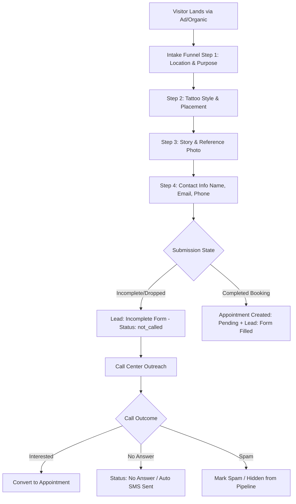

# 🏛️ CLEOPATRA CRM — MASTER ARCHITECTURAL & UI/UX DESIGN BLUEPRINT

> **Document Purpose:** Complete, exhaustive system specification, database data dictionary, business workflows, and screen-by-screen UX design blueprint for recreating and designing the Cleopatra CRM & Booking Platform.

---

## 📑 TABLE OF CONTENTS

1. [Executive Overview & Product Vision](#1-executive-overview--product-vision)
2. [Complete Database Schema & Data Dictionary](#2-complete-database-schema--data-dictionary)
3. [Core Domain Models & Enums](#3-core-domain-models--enums)
4. [Business Workflows & Logic](#4-business-workflows--logic)
    - 4.1 [Lead Lifecycle & Funnel Tracking](#41-lead-lifecycle--funnel-tracking)
    - 4.2 [Appointment & Booking Management](#42-appointment--booking-management)
    - 4.3 [Marketing Attribution & UTM Engine](#43-marketing-attribution--utm-engine)
    - 4.4 [Two-Way SMS & Live Messaging Engine](#44-two-way-sms--live-messaging-engine)
    - 4.5 [Vonage VoIP Call Center & Audio Streaming](#45-vonage-voip-call-center--audio-streaming)
    - 4.6 [Multi-Location & Role-Based Access Control](#46-multi-location--role-based-access-control)
5. [Complete Screen-by-Screen UI/UX Specification](#5-complete-screen-by-screen-uiux-specification)
    - 5.1 [Global Layout, Navigation & Design System](#51-global-layout-navigation--design-system)
    - 5.2 [Screen 1: Executive Dashboard & KPIs](#52-screen-1-executive-dashboard--kpis)
    - 5.3 [Screen 2: Leads Pipeline & Table View](#53-screen-2-leads-pipeline--table-view)
    - 5.4 [Screen 3: Lead Detail 360° View](#54-screen-3-lead-detail-360-view)
    - 5.5 [Screen 4: Appointments List & Calendar](#55-screen-4-appointments-list--calendar)
    - 5.6 [Screen 5: Appointment Detail View](#56-screen-5-appointment-detail-view)
    - 5.7 [Screen 6: Two-Way SMS Chat Messenger](#57-screen-6-two-way-sms-chat-messenger)
    - 5.8 [Screen 7: Call Center & VoIP Hub](#58-screen-7-call-center--voip-hub)
    - 5.9 [Screen 8: Funnel & Marketing Analytics](#59-screen-8-funnel--marketing-analytics)
    - 5.10 [Screen 9: Branches & Locations Management](#510-screen-9-branches--locations-management)
    - 5.11 [Screen 10: Staff & Tattoo Artists](#511-screen-10-staff--tattoo-artists)
    - 5.12 [Screen 11: Settings & Integration Hub](#512-screen-11-settings--integration-hub)
6. [Component Library & Interactive Behaviors](#6-component-library--interactive-behaviors)

---

## 1. EXECUTIVE OVERVIEW & PRODUCT VISION

**Cleopatra CRM** is an enterprise-grade Customer Relationship Management, Intake Funnel, and Booking Operations platform custom-built for **Cleopatra Ink** (a premier global tattoo studio chain with 50+ studios across USA, Europe, and Turkey).

### Primary Capabilities:

1. **Multi-Step Intake & Booking Funnel:** Captures client design ideas, body placements, tattoo styles, reference images, and booking preferences with granular drop-off tracking.
2. **360° Marketing Attribution:** Tracks precise campaign origins (Google Ads, Facebook, Instagram, TikTok, Threads, Organic) down to UTM parameters, click IDs (`gclid`, `fbclid`, `ttclid`), and device metadata.
3. **Omnichannel Communication:**
    - **2-Way SMS Messenger:** Live chat interface with Twilio/carrier integration, message threading, unread counters, MMS media attachments, and automated opt-out compliance.
    - **Vonage VoIP Call Center:** Full integration with Vonage Business Cloud (VBC), syncing thousands of incoming/outgoing calls, live extension mapping, audio recordings playback, and agent performance tracking.
4. **Multi-Location Hierarchy:** Studio-based isolation, local timezone handling, and custom staff assignment.

---

## 2. COMPLETE DATABASE SCHEMA & DATA DICTIONARY

Below is the complete reference of all database tables, columns, indexes, and relationships in the CRM.

### 2.1 `customers` (Leads & Clients)

Primary table for all leads, inquiries, and customer profiles.

- **`id`** `CHAR(36) PK`: UUID primary key.
- **`booking_session_id`** `BIGINT UNSIGNED NULL`: Links to the initial web intake session.
- **`name`** `VARCHAR(255) NULL`: Customer full name.
- **`email`** `VARCHAR(255) NULL` `INDEX`: Email address.
- **`phone`** `VARCHAR(255) NULL` `INDEX`: Raw phone number input.
- **`formatted_phone`** `VARCHAR(20) NULL` `INDEX`: E.164 normalized international phone number (e.g. `+19803521019`).
- **`company`** `VARCHAR(255) NULL`: Optional company/business name.
- **`status`** `VARCHAR(50) DEFAULT 'new'`: Intake form status (`new`, `incomplete`, `filled`, `done`).
- **`call_status`** `VARCHAR(50) NULL` `INDEX`: Lead calling pipeline status (see Section 3 for all 14 enum values).
- **`last_called_at`** `TIMESTAMP NULL`: Timestamp of the most recent phone outreach.
- **`notes`** `TEXT NULL`: Quick legacy notes.
- **`metadata`** `JSON NULL`: Extended form attributes, tattoo style choices, reference images, body area selections.
- **`unsubscribed_at`** `TIMESTAMP NULL`: SMS/Email opt-out timestamp.
- **`created_at` / `updated_at`** `TIMESTAMP`: Standard timestamps.

### 2.2 `booking_appointments` (Consultation & Tattoo Bookings)

Table holding formal booking requests submitted by customers or converted from leads.

- **`id`** `BIGINT UNSIGNED PK AUTO_INCREMENT`.
- **`uuid`** `CHAR(36) UNIQUE`: Public tracking UUID.
- **`timely_location_id`** `BIGINT UNSIGNED NULL FK`: Branch studio (`timely_locations.id`).
- **`customer_id`** `CHAR(36) NULL FK`: Matched customer (`customers.id`).
- **`booking_session_id`** `BIGINT UNSIGNED NULL FK`: Matched intake session (`booking_sessions.id`).
- **`full_name`** `VARCHAR(255)`: Client name.
- **`email`** `VARCHAR(255) INDEX`: Client email.
- **`phone`** `VARCHAR(255) INDEX`: Client phone.
- **`formatted_phone`** `VARCHAR(20) NULL INDEX`: E.164 phone number.
- **`purpose`** `VARCHAR(100)`: Booking purpose (`new` tattoo, `touchup`, `coverup`, `consultation`).
- **`style`** `VARCHAR(100)`: Tattoo style (e.g. `Realism`, `Minimalist`, `Old School`, `Fine Line`, `Tribal`, `Lettering`).
- **`story_type`** `VARCHAR(100)`: Client design origin (`have_idea`, `have_reference`, `artist_choice`).
- **`story_description`** `TEXT NULL`: Client's detailed story and design notes.
- **`reference_image`** `VARCHAR(255) NULL`: Uploaded photo/reference artwork path.
- **`body_areas`** `JSON NULL`: Array of target body placements (`['Forearm', 'Chest', 'Back']`).
- **`size`** `VARCHAR(100)`: Dimensions (e.g. `< 5cm`, `5-10cm`, `10-20cm`, `Full Sleeve`).
- **`preferred_date`** `DATE NULL`: Requested appointment date.
- **`preferred_time`** `VARCHAR(50) NULL`: Requested time slot (e.g. `14:00`).
- **`sms_consent`** `BOOLEAN DEFAULT TRUE`: Legal SMS marketing consent.
- **`language`** `VARCHAR(10) DEFAULT 'en'`: Customer language code.
- **`status`** `VARCHAR(50) DEFAULT 'pending' INDEX`: Appointment state (`pending`, `confirmed`, `cancelled`, `unreachable`, `sms_sent`, `spam`, `not_trusted`).
- **`is_free_pick`** `BOOLEAN DEFAULT FALSE INDEX`: Special promotional free consultation indicator.
- **`ip_address`** `VARCHAR(45) NULL`: Submission IP.
- **`ip_country`** `VARCHAR(10) NULL`: Geo-IP country.
- **`user_timezone`** `VARCHAR(50) NULL`: Submitting browser's timezone (e.g. `America/Los_Angeles`).
- **`created_at` / `updated_at`** `TIMESTAMP`.

### 2.3 `booking_sessions` (Intake Funnel Tracking)

Logs every unique web visitor intake session step-by-step.

- **`id`** `BIGINT UNSIGNED PK AUTO_INCREMENT`.
- **`session_uuid`** `CHAR(36) UNIQUE`: Web visitor cookie UUID.
- **`location_slug`** `VARCHAR(100) NULL INDEX`: Branch studio slug.
- **`current_step`** `INT DEFAULT 1`: Funnel drop-off step tracker (1 to 7).
- **`is_completed`** `BOOLEAN DEFAULT FALSE INDEX`: Whether the funnel was completed.
- **`landing_url`** `TEXT NULL`: Initial landing URL with full query string.
- **`referer`** `TEXT NULL`: HTTP referer header.
- **`utm_source`** `VARCHAR(255) NULL INDEX`: e.g. `google`, `facebook`, `instagram`, `tiktok`.
- **`utm_medium`** `VARCHAR(255) NULL`: e.g. `cpc`, `stories`, `bio_link`, `reels`.
- **`utm_campaign`** `VARCHAR(255) NULL`: e.g. `summer_promo_tacoma`.
- **`utm_term`** `VARCHAR(255) NULL`: Keywords.
- **`utm_content`** `VARCHAR(255) NULL`: Ad creative variant.
- **`gclid`** `VARCHAR(255) NULL INDEX`: Google Ads Click ID.
- **`fbclid`** `VARCHAR(255) NULL INDEX`: Meta Click ID.
- **`ttclid`** `VARCHAR(255) NULL INDEX`: TikTok Click ID.
- **`device_type`** `VARCHAR(50) NULL`: `mobile`, `desktop`, `tablet`.
- **`browser`** `VARCHAR(100) NULL`: `Chrome`, `Safari`, `Instagram InApp`.
- **`operating_system`** `VARCHAR(100) NULL`: `iOS`, `Android`, `macOS`, `Windows`.
- **`step_data`** `JSON NULL`: Key-value answers saved at each step before submission.
- **`created_at` / `updated_at`** `TIMESTAMP`.

### 2.4 `vonage_call_logs` (VoIP Call Center History)

Synced live from Vonage Business Cloud Reports API.

- **`id`** `BIGINT UNSIGNED PK AUTO_INCREMENT`.
- **`call_id`** `VARCHAR(255) UNIQUE INDEX`: Unique Vonage UUID.
- **`timely_location_id`** `BIGINT UNSIGNED NULL FK INDEX`: Matched branch.
- **`customer_id`** `CHAR(36) NULL FK INDEX`: Matched customer UUID.
- **`booking_appointment_id`** `BIGINT UNSIGNED NULL FK INDEX`: Matched booking appointment.
- **`from_number`** `VARCHAR(50) INDEX`: Caller phone or internal extension.
- **`to_number`** `VARCHAR(50) INDEX`: Callee phone or internal extension.
- **`direction`** `VARCHAR(20) INDEX`: `inbound` or `outbound`.
- **`start_time`** `TIMESTAMP NULL INDEX`: Call initiation UTC time.
- **`end_time`** `TIMESTAMP NULL`: Call disconnect time.
- **`duration`** `INT DEFAULT 0 INDEX`: Call talk duration in seconds.
- **`result`** `VARCHAR(50) NULL INDEX`: Direct Vonage call outcome status (`Answered`, `Voicemail`, `Missed`, `Attempted`).
- **`source_user`** `VARCHAR(100) NULL`: Vonage user login ID (e.g. `Cleo.Tacoma`).
- **`destination_user`** `VARCHAR(100) NULL`: Vonage callee login ID (e.g. `Cleo.Callcenter9`).
- **`recording_url`** `TEXT NULL`: Remote Vonage recording URL.
- **`recording_file_path`** `VARCHAR(255) NULL`: Locally archived MP3 file path.
- **`raw_data`** `JSON NULL`: Full payload from Vonage API (includes `source_user_full_name`, `destination_extension`, etc.).
- **`created_at` / `updated_at`** `TIMESTAMP`.

### 2.5 `vonage_extensions` (Directory of Agents & Studios)

Directory of all Vonage extensions, names, emails, DIDs, and studio mapping.

- **`id`** `BIGINT UNSIGNED PK AUTO_INCREMENT`.
- **`extension`** `VARCHAR(20) UNIQUE INDEX`: Extension number (e.g. `462`, `432`, `403`).
- **`display_name`** `VARCHAR(255)`: Full display name (e.g. `Cleopatra Ink Tacoma`, `Cleopatra Ink Callcenter9`).
- **`username`** `VARCHAR(100) NULL INDEX`: System username (e.g. `Cleo.Tacoma`).
- **`phone_number`** `VARCHAR(50) NULL`: Direct Inward Dialing (DID) formatted phone.
- **`formatted_phone`** `VARCHAR(20) NULL`: E.164 phone number.
- **`email`** `VARCHAR(255) NULL`: Agent email.
- **`user_type`** `VARCHAR(50) DEFAULT 'END_USER'`: `ACCOUNT_ADMINISTRATOR`, `END_USER`, `REPORTS_ADMIN`.
- **`timely_location_id`** `BIGINT UNSIGNED NULL FK`: Associated studio branch.
- **`created_at` / `updated_at`** `TIMESTAMP`.

### 2.6 `sms_conversations` (SMS Chat Threads)

Index table grouping all SMS messages by phone number.

- **`id`** `BIGINT UNSIGNED PK AUTO_INCREMENT`.
- **`phone`** `VARCHAR(20) UNIQUE INDEX`: E.164 phone number.
- **`customer_id`** `CHAR(36) NULL FK INDEX`: Matched customer UUID.
- **`customer_name`** `VARCHAR(255) NULL`: Cached customer name.
- **`unread_count`** `INT DEFAULT 0 INDEX`: Number of unread inbound messages.
- **`latest_message_body`** `TEXT NULL`: Snippet of the last message sent or received.
- **`latest_message_at`** `TIMESTAMP NULL INDEX`: Timestamp of the latest message.
- **`latest_direction`** `VARCHAR(20) NULL`: `inbound` or `outbound`.
- **`created_at` / `updated_at`** `TIMESTAMP`.

### 2.7 `sms_logs` / `customer_messages` (Individual SMS/MMS Messages)

Individual message history.

- **`id`** `BIGINT UNSIGNED PK AUTO_INCREMENT`.
- **`customer_id`** `CHAR(36) NULL FK INDEX`: Matched customer.
- **`booking_appointment_id`** `BIGINT UNSIGNED NULL FK`: Matched appointment.
- **`from_number`** `VARCHAR(50) INDEX`: Sender.
- **`to_number`** `VARCHAR(50) INDEX`: Receiver.
- **`direction`** `VARCHAR(20) INDEX`: `inbound` / `outbound`.
- **`body`** `TEXT NULL`: Message text.
- **`media_urls`** `JSON NULL`: Array of MMS attachment URLs (images/files).
- **`status`** `VARCHAR(50) DEFAULT 'sent'`: `delivered`, `sent`, `received`, `failed`.
- **`provider`** `VARCHAR(50) DEFAULT 'twilio'`: Communication gateway.
- **`provider_sid`** `VARCHAR(255) NULL INDEX`: Gateway message SID.
- **`created_at` / `updated_at`** `TIMESTAMP`.

### 2.8 `timely_locations` (Studio Branches)

Master table of all physical tattoo studio locations.

- **`id`** `BIGINT UNSIGNED PK AUTO_INCREMENT`.
- **`timely_id`** `VARCHAR(100) NULL INDEX`: Remote Timely sync ID.
- **`name`** `VARCHAR(255)`: Branch name (e.g. `Cleopatra Ink Tacoma`, `Cleopatra Ink Miami`).
- **`slug`** `VARCHAR(100) UNIQUE INDEX`: URL identifier (e.g. `tacoma`, `miami`).
- **`phone`** `VARCHAR(100) NULL`: Branch contact number.
- **`email`** `VARCHAR(255) NULL`: Branch manager email.
- **`address`** `VARCHAR(255) NULL`: Street address.
- **`city`** `VARCHAR(100) NULL`: City.
- **`state`** `VARCHAR(100) NULL`: State / Province.
- **`country`** `VARCHAR(100) NULL`: Country.
- **`gtm_country`** `VARCHAR(10) DEFAULT 'US'`: Country code for phone formatting.
- **`timezone`** `VARCHAR(50) DEFAULT 'America/New_York'`: Local studio timezone.
- **`latitude` / `longitude`** `DECIMAL(10,8) / DECIMAL(11,8)`: Coordinates.
- **`booking_active`** `BOOLEAN DEFAULT TRUE INDEX`: Booking engine availability toggle.
- **`opening_hours`** `JSON NULL`: Weekly operating schedule.
- **`created_at` / `updated_at`** `TIMESTAMP`.

### 2.9 `timely_staffs` (Tattoo Artists & Studio Personnel)

Artists and personnel roster.

- **`id`** `BIGINT UNSIGNED PK AUTO_INCREMENT`.
- **`timely_id`** `VARCHAR(100) NULL INDEX`: Remote staff ID.
- **`name`** `VARCHAR(255)`: Artist full name.
- **`email`** `VARCHAR(255) NULL`: Email.
- **`phone`** `VARCHAR(100) NULL`: Phone.
- **`bio`** `TEXT NULL`: Artist biography / specialties.
- **`avatar_url`** `VARCHAR(255) NULL`: Profile picture.
- **`portfolio_urls`** `JSON NULL`: Array of Instagram / gallery links.
- **`is_active`** `BOOLEAN DEFAULT TRUE INDEX`.
- **`created_at` / `updated_at`** `TIMESTAMP`.

### 2.10 `internal_notes` (Staff Notes & Comments)

Polymorphic notes engine attached to Leads, Appointments, and Customers.

- **`id`** `BIGINT UNSIGNED PK AUTO_INCREMENT`.
- **`user_id`** `BIGINT UNSIGNED NULL FK`: Staff member who authored the note (`users.id`).
- **`notable_type`** `VARCHAR(255) INDEX`: Target model (`App\Models\Customer` or `App\Models\BookingAppointment`).
- **`notable_id`** `VARCHAR(255) INDEX`: Target ID (UUID or BigInt).
- **`content`** `TEXT`: Note markdown/plain text.
- **`created_at` / `updated_at`** `TIMESTAMP`.

### 2.11 `users` & `location_user` (CRM Staff & RBAC)

- **`users`**: `id`, `name`, `email`, `password`, `role` (`super_admin`, `admin`, `call_center`, `studio_manager`, `artist`), `has_all_locations` (boolean).
- **`location_user`**: `user_id`, `timely_location_id` (Many-to-Many branch access rights).

### 2.12 `customer_unsubscribes` & `settings`

- **`customer_unsubscribes`**: `id`, `customer_id`, `phone`, `reason`, `created_at`.
- **`settings`**: `id`, `key` (e.g. `vonage_account_id`, `vonage_consumer_key`, `twilio_sid`), `value`, `created_at`, `updated_at`.

---

## 3. CORE DOMAIN MODELS & ENUMS

### 3.1 Lead Calling Statuses (`call_status`)

There are **14 distinct statuses** in the Lead Outreach Pipeline:

1. **`not_called`** _(Default)_: New lead, never contacted.
2. **`no_answer`**: Outbound call made, no answer / voicemail.
3. **`busy`**: Line was busy / declined.
4. **`interested`**: Client spoke, expressed strong interest.
5. **`not_interested`**: Client declined or cancelled interest.
6. **`wrong_number`**: Invalid contact info.
7. **`appointment_made`**: Lead converted into a booked consultation/session.
8. **`callback_requested`**: Client asked to be called at a specific time.
9. **`already_scheduled`**: Client already booked via another channel.
10. **`no_pn`**: No phone number provided in the intake form.
11. **`double_lead`**: Duplicate lead entry from the same person.
12. **`didnt_pick_up`**: Repeated unreachable outreach.
13. **`spam`**: Junk submission / bot.
14. **`not_trusted`**: Suspicious activity / flagged IP.

### 3.2 Appointment Statuses (`status`)

1. **`pending`**: Newly submitted, awaiting studio review.
2. **`confirmed`**: Studio confirmed time, date, and artist.
3. **`cancelled`**: Cancelled by client or studio.
4. **`unreachable`**: Client could not be reached to confirm.
5. **`sms_sent`**: Automated confirmation SMS dispatched.
6. **`spam`**: Filtered spam submission.
7. **`not_trusted`**: Flagged untrusted submission.

### 3.3 Tattoo Design Enums

- **Purposes:** `new`, `coverup`, `touchup`, `consultation`.
- **Story Types:** `have_idea` (has concept), `have_reference` (has photo reference), `artist_choice` (wants artist custom design).
- **Sizes:** `Mini (< 5cm)`, `Small (5-10cm)`, `Medium (10-20cm)`, `Large (Half Sleeve)`, `Extra Large (Full Sleeve / Backpiece)`.

---

## 4. BUSINESS WORKFLOWS & LOGIC

### 4.1 Lead Lifecycle & Funnel Tracking

### 4.2 Marketing Attribution Engine

- **Automatic Platform Classification:**
    - **Google Ads:** If `gclid`, `gbraid`, `wbraid`, or `utm_source` contains `google`.
    - **Facebook:** If `fbclid` or `utm_source` contains `facebook` or `fb`.
    - **Instagram:** If `utm_source` contains `instagram` or `ig`, or referer matches `instagram.com`.
    - **TikTok:** If `ttclid` or `utm_source` contains `tiktok`.
    - **Threads:** If `utm_source` contains `threads` or `th`.
    - **Direct:** If all UTMs and click IDs are null.

### 4.3 Vonage VoIP Call Center & Audio Streaming

- **Real-time Syncing:** Queries Vonage Reports API (`/reports/v1/accounts/{accountId}/call-logs`) for incoming and outgoing calls.
- **Call Result Classification:** Synced directly from Vonage API payload:
    - 🟢 `Answered`: Call was connected and spoken. Full audio recording stream available.
    - 🟣 `Voicemail`: Call was routed to agent or customer voicemail inbox. Audio recording stream available.
    - 🔴 `Missed`: Call rang but was not answered.
    - ⚪ `Attempted`: Call initialization attempted but cancelled before connection.
- **Auto-Discovery of Staff & Extensions:** Parses `source_user_full_name`, `destination_extension`, and `source_user` from incoming call payloads and dynamically upserts into `vonage_extensions`.
- **On-Demand Audio Streaming Proxy:**
    - Endpoint: `/admin/call-center/recording/{callId}`
    - Fetches MP3 from Vonage API on the fly, caches it to `storage/app/public/vonage_recordings/{callId}.mp3`, and streams byte ranges with standard HTML5 audio headers.

---

## 5. COMPLETE SCREEN-BY-SCREEN UI/UX SPECIFICATION

### 5.1 Global Layout, Navigation & Design System

- **Aesthetics:** Sleek, modern dark-and-light capable UI with refined slate/indigo/emerald palettes, crisp typography (Inter or Plus Jakarta Sans), smooth micro-animations, and zero visual clutter.
- **Top Navigation Bar:**
    - Global Search Bar (Omnisearch for Name, Email, Phone, Booking UUID).
    - Branch/Location Selector Dropdown (Allows filtering entire CRM by specific studio or "All Studios").
    - Date Range Filter (Today, Last 7 Days, Last 30 Days, Custom Range).
    - Quick VoIP / Call Center Status Indicator (Live Active Calls counter).
    - User Avatar & Studio Profile Menu.
- **Sidebar Menu Structure:**
    1. 📊 **Dashboard** (`/admin/dashboard`)
    2. 👥 **Leads Pipeline** (`/admin/leads`) — _Badge showing uncalled leads count_
    3. 📅 **Appointments** (`/admin/booking/appointments`) — _Badge showing pending bookings_
    4. 💬 **SMS Messenger** (`/admin/sms-chat`) — _Badge showing total unread SMS_
    5. 📞 **Call Center Hub** (`/admin/call-center`) — _Live statistics & recording archives_
    6. 📈 **Reports & Funnel** (`/admin/booking/reports`)
    7. 🏢 **Studios & Branches** (`/admin/booking/locations`)
    8. 👨‍🎨 **Staff & Artists** (`/admin/timely-accounts`)
    9. ⚙️ **Settings & API Keys** (`/admin/settings/general`)

---

### 5.2 Screen 1: Executive Dashboard & KPIs

- **KPI Metrics Cards (Top Row):**
    - **Total Inquiries / Leads:** Number of leads + % change vs last period.
    - **Appointments Booked:** Total bookings + conversion rate from leads.
    - **Call Center Volume:** Total calls (Inbound / Outbound / Missed) + Avg talk duration.
    - **Top Marketing Channels:** Breakdown by Facebook, Instagram, Google Ads, TikTok.
- **Visual Charts:**
    - **Lead Funnel Drop-off Bar Chart:** Shows drop-offs at Step 1 (Studio), Step 2 (Style), Step 3 (Story), Step 4 (Contact).
    - **Daily Volume Timeline:** Area chart of daily Leads vs Appointments vs Calls.
- **Real-Time Activity Feeds:**
    - **Recent Inquiries Feed:** Live stream of newly submitted intake forms.
    - **Recent Call Activity:** Live incoming/outgoing VoIP calls with audio player triggers.

---

### 5.3 Screen 2: Leads Pipeline & Table View

- **Header & Controls:**
    - Lead Search Input (Instant search across Name, Email, Raw Phone, Formatted Phone).
    - Location Filter (Dropdown of studios).
    - Call Status Filter Tabs: `All Active`, `Not Called`, `No Answer`, `Busy`, `Interested`, `Callback Requested`, `Appointment Made`, `Spam`.
    - Platform Filter Pills: `All`, `Instagram`, `Facebook`, `Google`, `TikTok`, `Direct`.
    - Date Range Picker & Export CSV Button.
- **Table Columns:**
    1. **Client Info:** Full Name, Date & Relative Time (`2 hours ago`), Duplicate Badge (if duplicate exists).
    2. **Contact & Call Trigger:**
        - Email address.
        - Normalized Phone number (`+12812632675`).
        - **Interactive `📞 Calls [Count]` Badge Button:** Clicking opens the Call History Modal with audio recordings.
    3. **Attribution & Source:** Marketing Platform pill (e.g. `Instagram Stories`, `Google Ads`) with UTM campaign tooltip.
    4. **Call Status Dropdown (Inline Editing):** Quick dropdown to change status (`Not Called`, `Interested`, etc.) with instant AJAX save and toast notification.
    5. **Actions:**
        - `Detail` button (links to 360° Lead View).
        - `Notes [Count]` button (opens quick notes drawer).
        - `Convert` button (converts lead into a confirmed appointment).

---

### 5.4 Screen 3: Lead Detail 360° View

- **Top Header Bar:**
    - Client Name, Email, Formatted Phone.
    - Current Call Status Badge.
    - Action Buttons: `💬 SMS Chat`, `📞 Calls [Count]`, `Convert to Appointment`, `Mark as Spam`.
- **Left Column — Client Profile & Tattoo Request:**
    - **Tattoo Specifications:** Purpose, Style, Body Placement, Approximate Size.
    - **Client Story / Idea:** Full text description of what the client wants.
    - **Reference Artwork Gallery:** Uploaded image cards with GLightbox full-screen preview.
- **Middle Column — Communications History:**
    - **Two-Way SMS History:** Message timeline with speech bubbles, timestamps, and inline image attachments.
    - **Quick SMS Reply Box:** Textarea to type and send an instant SMS directly from the page.
- **Right Column — Call Logs & Internal Notes:**
    - **Attached VoIP Calls List:** Every call made to/from this client, duration, agent name, and HTML5 audio player.
    - **Internal Notes Feed:** Staff private notes with author avatar and timestamp + "+ Add Note" form.
    - **Attribution Metadata Card:** Exact UTM parameters, IP, device type, browser, and landing URL.

---

### 5.5 Screen 4: Appointments List & Calendar

- **View Modes:** Toggle between **Table View** and **Interactive Calendar View** (Month / Week / Day).
- **Filters:** Studio Location, Status (`Pending`, `Confirmed`, `Cancelled`, `Unreachable`), Free Consultation Pick (`is_free_pick`), Date Range.
- **Table Columns:**
    1. **Client Name & Email:** With created timestamp.
    2. **Contact Info & Calls Badge:** Phone number + `📞 Calls [Count]` badge.
    3. **Studio Location:** Branch name pill.
    4. **Requested Date & Time:** Formatted appointment schedule.
    5. **Tattoo Details:** Style & placement snippet.
    6. **Marketing Source:** Source pill with campaign details.
    7. **Status Badge & Quick Actions:** `Pending`, `Confirmed`, `Detail` button.

---

### 5.6 Screen 5: Appointment Detail View

- **Overview Card:**
    - Booking UUID, Client Name, Email, Phone.
    - **Smooth Scroll Button:** `🎧 Calls [Count]` button that smoothly jumps down to the `#call-history-section`.
- **Tattoo Project Brief:**
    - Purpose, Style, Size, Target Body Areas.
    - Story Description.
    - High-resolution Reference Image with GLightbox viewer.
- **Schedule & Location Card:**
    - Assigned Studio Branch, Client Local Time, Requested Date & Time slot.
- **Call History & Recordings Section (`#call-history-section`):**
    - Summary Bar: Total Calls count, 🟢 Answered count, 🔴 Missed count.
    - Call Row Cards:
        - Direction icon: 📥 Inbound vs 📤 Outbound.
        - Flow description: e.g. `Customer ➔ Cleopatra Ink Tacoma (#432)`.
        - Phone numbers & exact timestamp: `12534219735 ➔ 432 • Sep 01, 2026 05:44:39`.
        - Status pill: `🟢 Answered (1m 35s)` or `🔴 Missed (0s)`.
        - **Integrated Audio Player:** Embedded HTML5 player streaming on-demand directly from Vonage API.
- **SMS Communication Thread & Internal Notes:**
    - Full SMS history with outbound composer.
    - Private staff notes timeline.

---

### 5.7 Screen 6: Two-Way SMS Chat Messenger

- **Layout:** Full-height, two-pane responsive messaging interface (similar to WhatsApp Web / iMessage).
- **Left Pane — Conversations List:**
    - Search conversations by client name or phone.
    - Unread messages filter tab.
    - Conversation item: Client Avatar, Name/Phone, Last message snippet, Timestamp (`2m ago`), Unread badge count (`3`).
- **Right Pane — Active Chat Window:**
    - **Chat Header:** Client Name, Phone, Matched Studio, "View Profile" link.
    - **Chat Messages Timeline:**
        - Inbound messages (left, light slate background).
        - Outbound staff messages (right, primary indigo/emerald background).
        - MMS Image Attachments with click-to-enlarge.
        - Delivery receipts (`Delivered`, `Sent`, `Failed`).
    - **Chat Composer:**
        - Multi-line message input.
        - Preset SMS Templates picker (e.g. "Appointment Confirmation", "Consultation Follow-up", "Deposit Request").
        - File/Photo attachment button.
        - Send button (`Enter` to send).
        - Opt-out status warning banner if client unsubscribed.

---

### 5.8 Screen 7: Call Center & VoIP Hub

- **Top Metric Cards:**
    - **Total Calls Synced:** All-time or date-filtered call count.
    - **Inbound Calls:** Total incoming inquiries + % answered.
    - **Outbound Calls:** Total agent outreach calls + % answered.
    - **Average Call Duration:** e.g. `2m 14s`.
    - **Missed Calls:** Count of unanswered calls.
- **Top Extensions & Agents Leaderboard:**
    - Ranked list of top calling extensions (e.g. `#432 Cleopatra Ink Tacoma`, `#462 Callcenter9`).
    - Total calls made, total minutes spoken, and answered ratio.
- **Live Call Records Table:**
    - Search by Phone, Extension, Agent, or Studio.
    - Columns: Call Direction, Flow (`Customer ➔ Extension`), From, To, Start Time, Duration, Status (`Answered` / `Missed`), Audio Player trigger (`Listen`).
- **Global Call Player Modal:**
    - Floating Alpine.js audio wave modal with play/pause, 1x/1.5x/2x playback speed toggle, interactive seek bar, and MP3 download button.

---

### 5.9 Screen 8: Funnel & Marketing Analytics

- **Funnel Conversion Matrix:**
    - Step 1: Sessions Initiated.
    - Step 2: Studio Selected.
    - Step 3: Tattoo Style Chosen.
    - Step 4: Contact Info Entered.
    - Step 5: Appointment Completed.
    - Step 6: Consultation Attended.
- **Campaign ROI & Channel Performance:**
    - Table grouping conversions by `utm_source`, `utm_medium`, and `utm_campaign`.
    - Metrics: Inquiries, Booked Appointments, Conversion %, Top Performing Ad Creative.

---

### 5.10 Screen 9: Branches & Locations Management

- **Studio Cards Grid & Table:**
    - Studio Name, Photo, Address, Local Timezone, Phone, Manager.
    - Live status toggle: `Booking Active` (Enable/Disable online booking instantly).
    - Operating Hours editor (Monday to Sunday opening & closing times).

---

### 5.11 Screen 10: Staff & Tattoo Artists

- **Artist Profile Roster:**
    - Artist Name, Assigned Studio Branches, Specialties (e.g. _Black & Grey, Micro-Realism_).
    - Portfolio gallery manager.
    - Active / Inactive booking status toggle.

---

### 5.12 Screen 11: Settings & Integration Hub

- **Vonage VBC Configuration:** API Key, Secret, Username, Password, Account ID, Sync status check.
- **Twilio Configuration:** Account SID, Auth Token, Outgoing Phone Numbers.
- **Timely Sync Settings:** Account credentials, bi-directional appointment sync triggers.
- **SMS & Email Templates:** Custom dynamic placeholder editor (`{customer_name}`, `{location_name}`, `{appointment_date}`).

---

## 6. COMPONENT LIBRARY & INTERACTIVE BEHAVIORS

### 6.1 Interactive Modals & Drawers

1. **Global Call History Modal (`<x-call-history-modal />`):**
    - Triggered anywhere via `window.openCallHistory({ phone, customerId, appointmentId, title })`.
    - Displays call statistics, direction, caller/receiver flow, duration, and on-demand audio playback.
2. **Notes Drawer:** Slides in from the right to view and add private staff notes.
3. **Duplicate Leads Checker Modal:** Scans matching emails, raw phones, and normalized phones to merge or compare duplicate customer profiles.

### 6.2 Phone Number Normalization Standards

- All customer and caller phone numbers are processed via `PhoneValidationService`.
- US numbers: Formatted to 10 digits `(980) 352-1019` for display and E.164 `+19803521019` for database indexing and Vonage/Twilio matching.
- International numbers: Normalized with country prefix (e.g. `+90...`, `+44...`).

---

_End of Cleopatra CRM Master Architectural & UI/UX Blueprint._
