# Cleopatra v3 — Sistem Akışları

> Her akış çalışan koda karşılık gelir ve test edilmiştir.
> Şema diyagramları için: [SCHEMA.md](./SCHEMA.md)

---

## 0. Genel resim

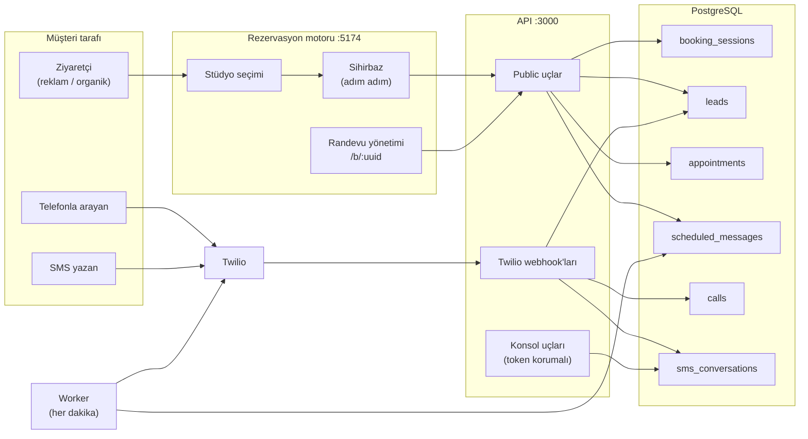

---

## 1. Lead yaşam döngüsü — projenin kalbi

**Kural:** Lead satırı asla silinmez. Çağrı hattının tek ölçütü `converted_at IS NULL`.

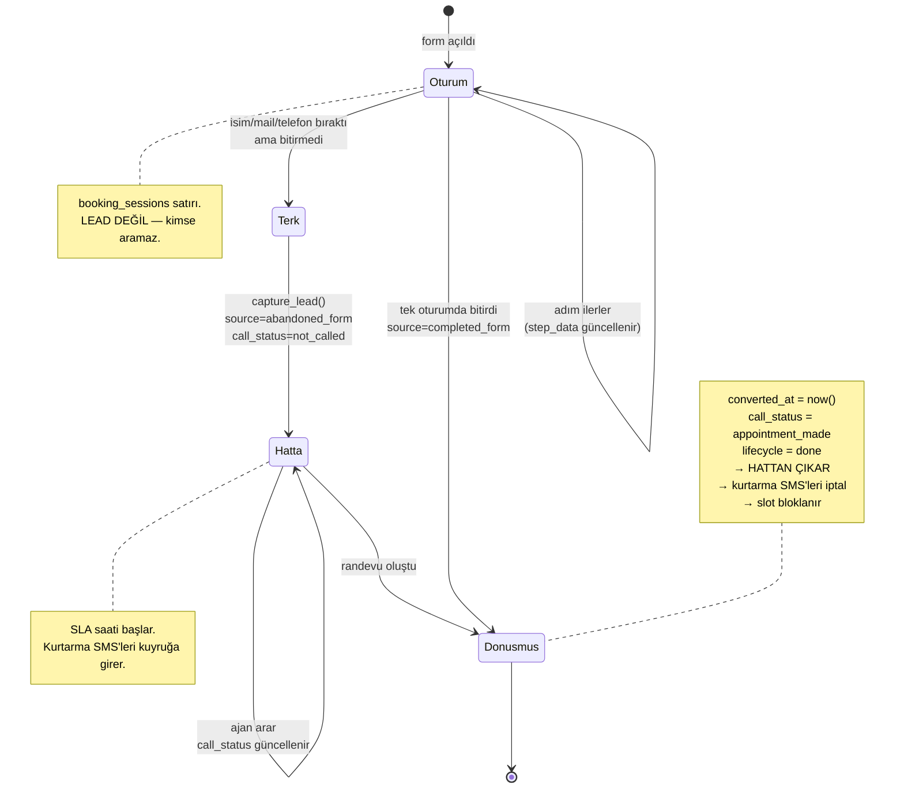

| Durum | Lead açılır mı? | Hatta görünür mü? |
|---|---|---|
| Form açtı, hiçbir şey bırakmadı | **Hayır** | — |
| Mail bıraktı, telefon yok | Evet, `call_status=no_pn` | Evet (aranamaz işaretli) |
| Telefon bıraktı, terk etti | Evet, `abandoned_form` | **Evet** |
| Terk etti, sonra döndü tamamladı | Aynı lead | Hayır — çıktı |
| Tek oturumda tamamladı | Evet, `completed_form` | **Hayır** — hiç girmedi |

---

## 2. Reklamdan gelen → önce iletişim

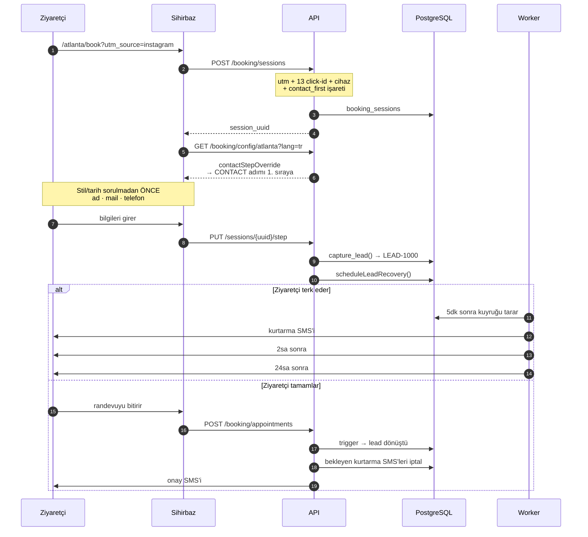

---

## 3. Gelen çağrı → şube telefonuna yönlendirme

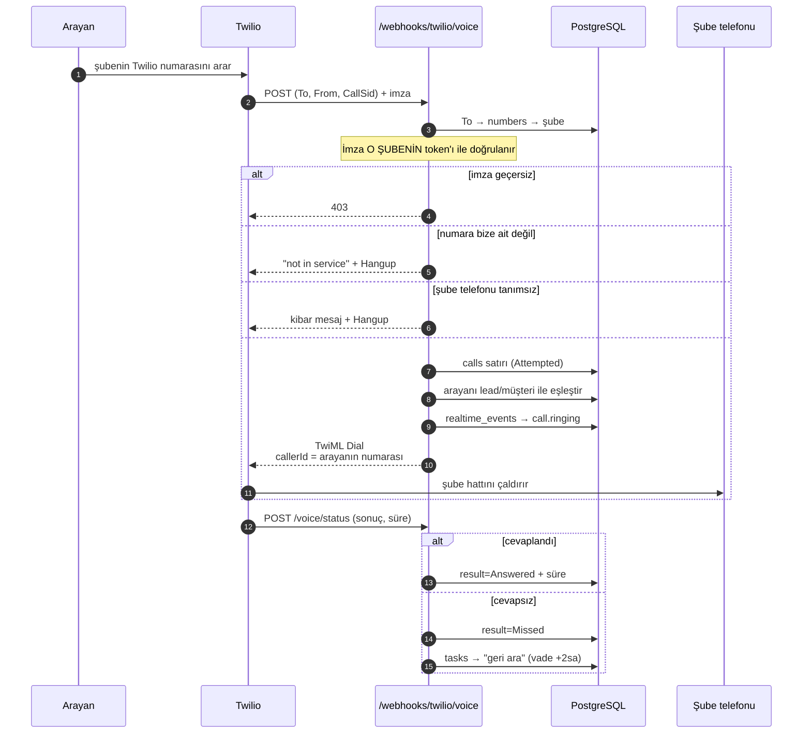

---

## 4. Gelen SMS & opt-out

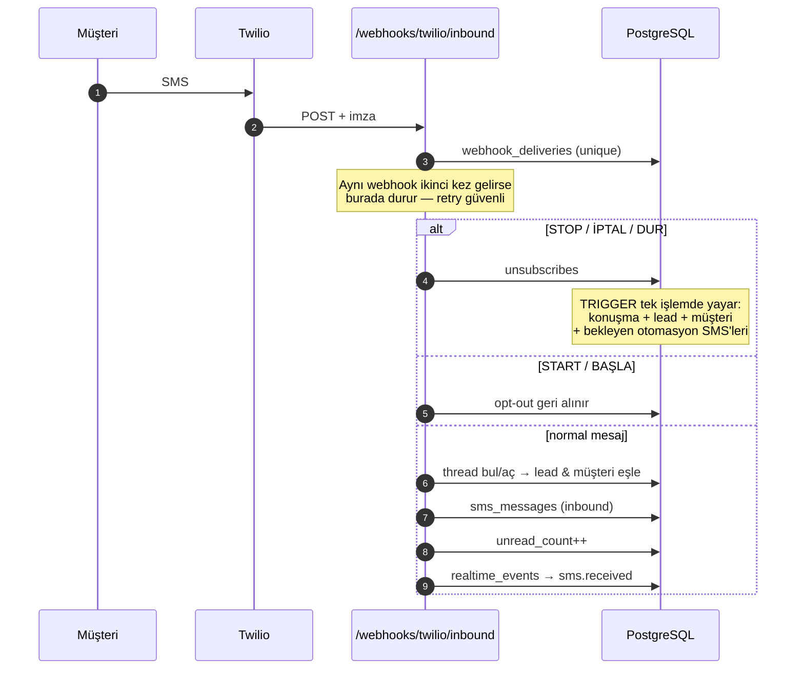

---

## 5. Giden SMS — tek huni

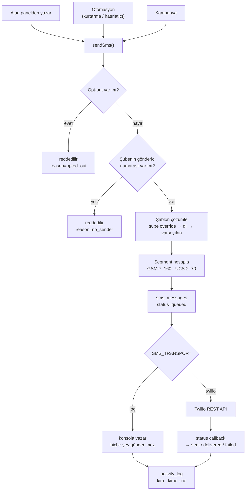

> `SMS_TRANSPORT` üretim dışında **varsayılan `log`**. Gerçek SMS göndermek bilinçli bir karar olmalı.

---

## 6. Otomasyon kuyruğu ve worker

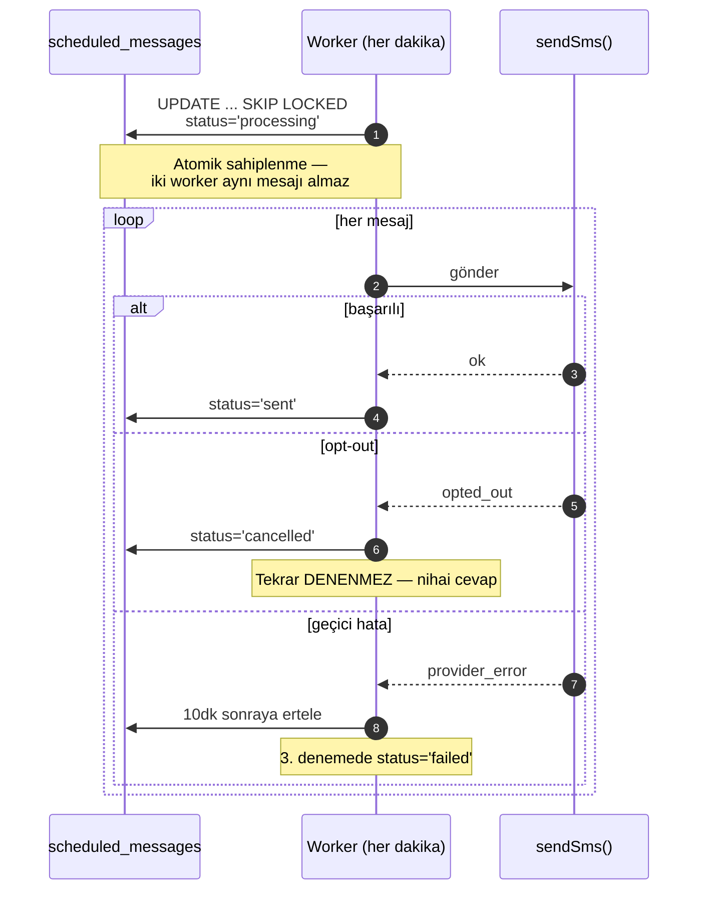

| Zamanlama | Ne zaman | İptal koşulu |
|---|---|---|
| `lead_recovery_5m` | telefon bırakıldıktan +5dk | randevu alındı / opt-out |
| `lead_recovery_2h` | +2 saat | aynı |
| `lead_recovery_24h` | +24 saat | aynı |
| `appointment_reminder_24h` | randevudan 24sa önce | iptal / opt-out |
| `appointment_reminder_3h` | randevudan 3sa önce | aynı |

> Geçmişte kalan hatırlatıcı hiç kurulmaz: yarın sabahki bir randevu için 24sa hatırlatıcısı zaten kaçmıştır, kurulursa anında patlardı.

---

## 7. Müsaitlik hesabı — saat dilimi kritik

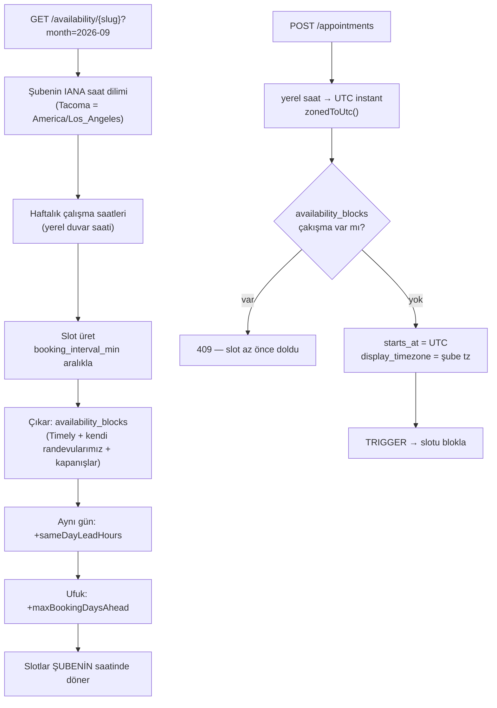

> **Neden önemli:** canlı sistemde 46 şubenin tamamı `America/New_York` kayıtlıydı. 21'i yanlıştı — Pacific şubelerde müşteriye gösterilen saat 3 saat kayıktı. Düzeltme `scripts/timezones.ts`'te.

---

## 8. Çok dillilik — 4 katmanlı çözümleme

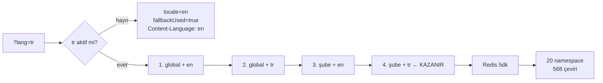

> Eskiden desteklenmeyen dil sessizce İngilizce dönüyordu, istemci bunu bilemiyordu. Artık `fallbackUsed` ve `Content-Language` açıkça söylüyor.

---

## 9. Randevu yönetimi (müşteri tarafı)

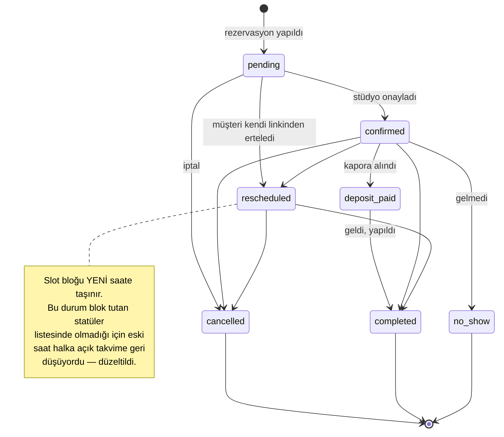

---

## 10. Denetlenebilirlik

Her yan etki bir kişiye (veya otomasyona) bağlanır:

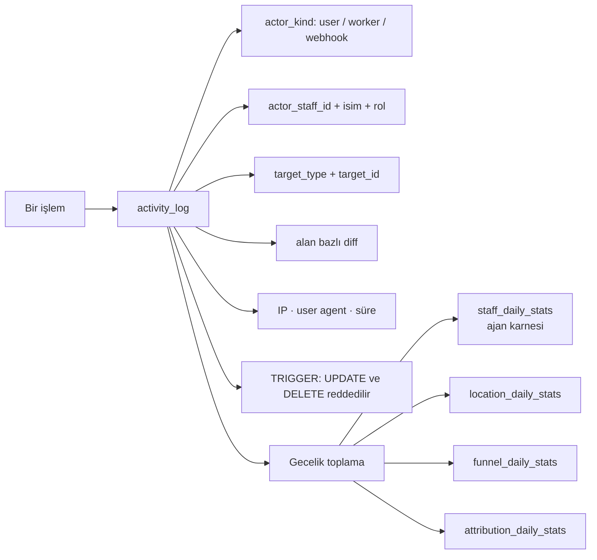
