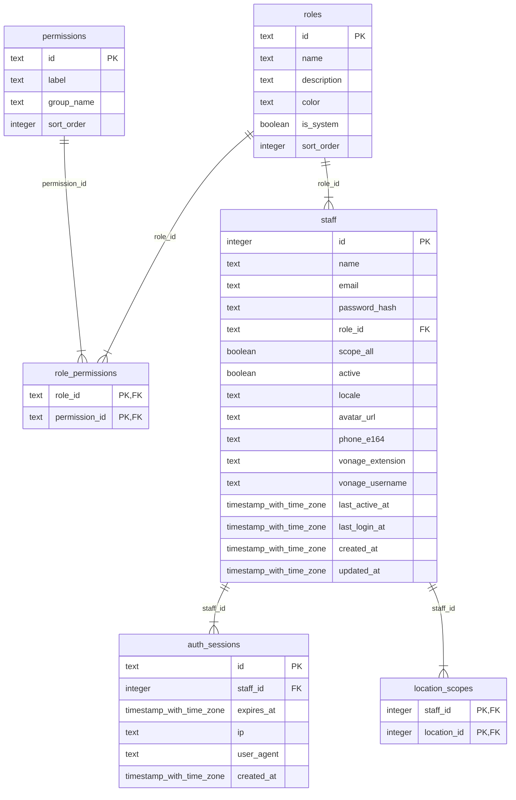
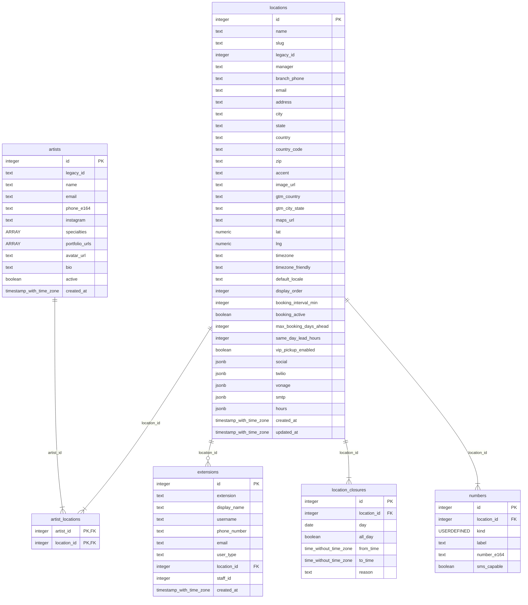
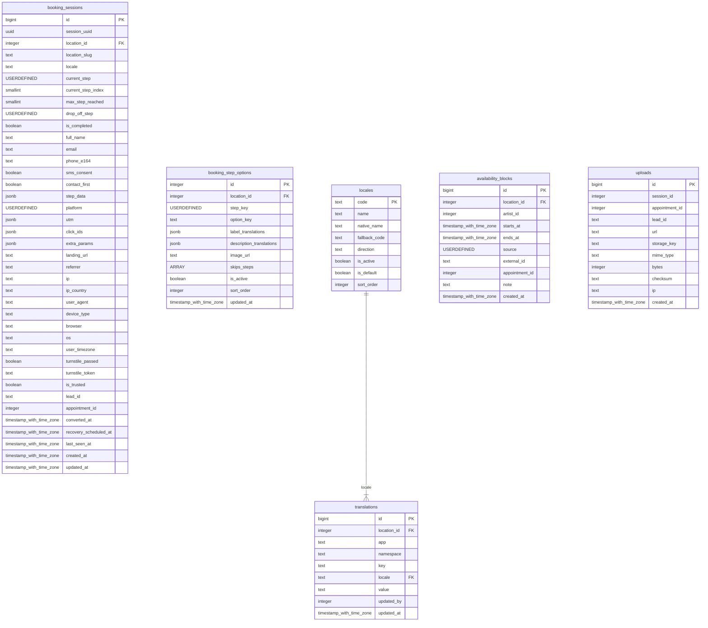
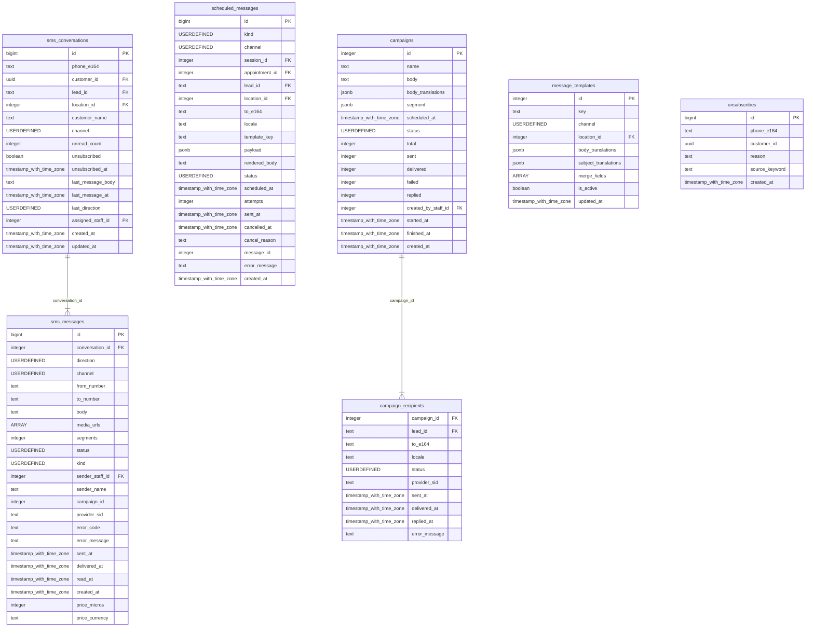
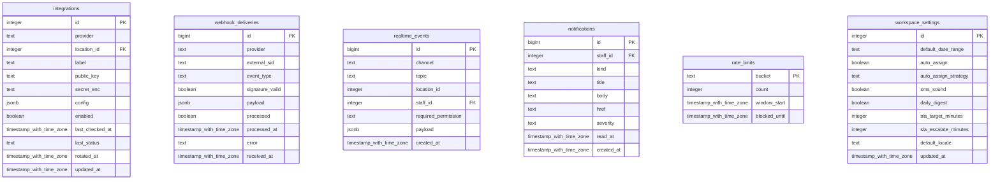

# Cleopatra v3 — Veritabanı Şeması

> Bu dosya **canlı veritabanından** üretilir: `npx tsx scripts/erd.ts`.
> Şema değişince yeniden çalıştır; diyagram asla koddan sapmaz.

Üretim: 2026-09-22T14:55:00.294Z · 46 tablo · 1 view · 70 yabancı anahtar

---

## Genel görünüm

Domainler arası bağlar. Her domainin detayı aşağıda.

```mermaid
flowchart LR
  subgraph rbac["1 · Yetki (RBAC)"]
    direction TB
    roles["roles<br/>6 satır"]
    permissions["permissions<br/>20 satır"]
    role_permissions["role_permissions<br/>87 satır"]
    staff["staff<br/>10 satır"]
    location_scopes["location_scopes<br/>9 satır"]
    auth_sessions["auth_sessions<br/>0 satır"]
  end
  subgraph studios["2 · Şubeler & ekip"]
    direction TB
    locations["locations<br/>46 satır"]
    numbers["numbers<br/>0 satır"]
    artists["artists<br/>0 satır"]
    artist_locations["artist_locations<br/>0 satır"]
    extensions["extensions<br/>0 satır"]
    location_closures["location_closures<br/>0 satır"]
  end
  subgraph booking["3 · Rezervasyon motoru"]
    direction TB
    booking_sessions["booking_sessions<br/>0 satır"]
    booking_step_options["booking_step_options<br/>16 satır"]
    translations["translations<br/>568 satır"]
    locales["locales<br/>4 satır"]
    availability_blocks["availability_blocks<br/>0 satır"]
    uploads["uploads<br/>0 satır"]
  end
  subgraph crm["4 · CRM çekirdek"]
    direction TB
    customers["customers<br/>0 satır"]
    leads["leads<br/>0 satır"]
    appointments["appointments<br/>0 satır"]
    calls["calls<br/>0 satır"]
    vonage_events["vonage_events<br/>0 satır"]
    notes["notes<br/>0 satır"]
    tasks["tasks<br/>0 satır"]
  end
  subgraph messaging["5 · Mesajlaşma"]
    direction TB
    sms_conversations["sms_conversations<br/>0 satır"]
    sms_messages["sms_messages<br/>0 satır"]
    scheduled_messages["scheduled_messages<br/>0 satır"]
    campaigns["campaigns<br/>0 satır"]
    campaign_recipients["campaign_recipients<br/>0 satır"]
    message_templates["message_templates<br/>0 satır"]
    unsubscribes["unsubscribes<br/>0 satır"]
  end
  subgraph reporting["6 · Denetim & raporlama"]
    direction TB
    activity_log["activity_log<br/>0 satır"]
    staff_presence["staff_presence<br/>0 satır"]
    staff_daily_stats["staff_daily_stats<br/>0 satır"]
    location_daily_stats["location_daily_stats<br/>0 satır"]
    funnel_daily_stats["funnel_daily_stats<br/>0 satır"]
    attribution_daily_stats["attribution_daily_stats<br/>0 satır"]
    demand_heatmap["demand_heatmap<br/>0 satır"]
    rollup_checkpoints["rollup_checkpoints<br/>0 satır"]
  end
  subgraph system["7 · Sistem"]
    direction TB
    integrations["integrations<br/>0 satır"]
    webhook_deliveries["webhook_deliveries<br/>0 satır"]
    realtime_events["realtime_events<br/>0 satır"]
    notifications["notifications<br/>0 satır"]
    rate_limits["rate_limits<br/>0 satır"]
    workspace_settings["workspace_settings<br/>1 satır"]
  end
  activity_log --> staff
  activity_log --> locations
  appointments --> artists
  appointments --> staff
  appointments --> locations
  appointments --> booking_sessions
  attribution_daily_stats --> locations
  availability_blocks --> locations
  booking_sessions --> locations
  booking_step_options --> locations
  calls --> locations
  calls --> staff
  campaign_recipients --> leads
  campaigns --> staff
  customers --> locations
  demand_heatmap --> locations
  funnel_daily_stats --> locations
  integrations --> locations
  leads --> staff
  leads --> locations
  leads --> booking_sessions
  location_daily_stats --> locations
  location_scopes --> locations
  message_templates --> locations
  notes --> staff
  notifications --> staff
  realtime_events --> staff
  scheduled_messages --> appointments
  scheduled_messages --> leads
  scheduled_messages --> locations
  scheduled_messages --> booking_sessions
  sms_conversations --> staff
  sms_conversations --> customers
  sms_conversations --> leads
  sms_conversations --> locations
  sms_messages --> staff
  staff_daily_stats --> locations
  staff_daily_stats --> staff
  staff_presence --> locations
  staff_presence --> staff
  tasks --> staff
  tasks --> locations
  translations --> locations
```

---

## 1 · Yetki (RBAC)

Kim giriş yapabilir, hangi izinlere ve hangi şubelere erişir.

**Bu domainden dışarı çıkan bağlar**

| Tablo | Kolon | → Hedef |
|---|---|---|
| `location_scopes` | `location_id` | `locations.id` |

---

## 2 · Şubeler & ekip

Stüdyolar, telefon numaraları (Twilio / Vonage / şube), sanatçılar, dahili numaralar.

---

## 3 · Rezervasyon motoru

Ziyaretçi oturumları (yarıda kalan istekler), çok dilli sözlük, adım seçenekleri, müsaitlik.

**Bu domainden dışarı çıkan bağlar**

| Tablo | Kolon | → Hedef |
|---|---|---|
| `availability_blocks` | `location_id` | `locations.id` |
| `booking_sessions` | `location_id` | `locations.id` |
| `booking_step_options` | `location_id` | `locations.id` |
| `translations` | `location_id` | `locations.id` |

---

## 4 · CRM çekirdek

Müşteri kimliği, lead hattı, randevular, çağrılar, notlar, görevler.

```mermaid
erDiagram
  customers {
    uuid id "PK"
    text public_uid
    text name
    text email
    text phone_e164
    integer location_id "FK"
    text locale
    timestamp_with_time_zone unsubscribed_at
    timestamp_with_time_zone first_touch_at
    timestamp_with_time_zone last_active_at
    uuid merged_into
    timestamp_with_time_zone created_at
    timestamp_with_time_zone updated_at
  }
  leads {
    text id "PK"
    uuid customer_id "FK"
    integer session_id "FK"
    integer location_id "FK"
    text name
    text email
    text phone_e164
    USERDEFINED platform
    USERDEFINED lifecycle_status
    USERDEFINED call_status
    text locale
    integer assigned_staff_id "FK"
    timestamp_with_time_zone assigned_at
    jsonb utm
    jsonb meta
    timestamp_with_time_zone first_called_at
    integer first_called_by_staff_id "FK"
    timestamp_with_time_zone last_called_at
    integer call_attempts
    timestamp_with_time_zone unsubscribed_at
    boolean turnstile_passed
    boolean is_trusted
    text merged_into
    timestamp_with_time_zone created_at
    timestamp_with_time_zone updated_at
    USERDEFINED source
    timestamp_with_time_zone converted_at
    integer converted_appointment_id
  }
  appointments {
    integer id "PK"
    text bk_uuid
    text lead_id "FK"
    uuid customer_id "FK"
    integer session_id "FK"
    integer location_id "FK"
    integer artist_id "FK"
    text name
    text email
    text phone_e164
    text purpose
    text style
    text size
    text story_type
    text story
    ARRAY body_areas
    text reference_image_url
    timestamp_with_time_zone starts_at
    timestamp_with_time_zone ends_at
    date preferred_date
    time_without_time_zone preferred_time
    text display_timezone
    text user_timezone
    USERDEFINED status
    text cancel_reason
    integer rescheduled_from_id
    integer assigned_staff_id "FK"
    integer confirmed_by_staff_id "FK"
    timestamp_with_time_zone confirmed_at
    integer completed_by_staff_id "FK"
    timestamp_with_time_zone completed_at
    integer cancelled_by_staff_id "FK"
    timestamp_with_time_zone cancelled_at
    integer estimated_price_cents
    integer deposit_cents
    boolean deposit_paid
    timestamp_with_time_zone deposit_paid_at
    integer final_price_cents
    text currency
    boolean is_free_pick
    text address_street
    text address_city
    text address_state
    text address_zip
    text locale
    USERDEFINED platform
    text campaign
    boolean consent
    boolean turnstile_passed
    boolean is_trusted
    text ip
    timestamp_with_time_zone created_at
    timestamp_with_time_zone updated_at
  }
  calls {
    bigint id "PK"
    USERDEFINED direction
    text from_number
    text to_number
    text from_name
    text to_name
    uuid customer_id "FK"
    text lead_id "FK"
    integer appointment_id "FK"
    integer location_id "FK"
    integer staff_id "FK"
    text agent_name
    text extension
    timestamp_with_time_zone start_time
    timestamp_with_time_zone end_time
    integer ring_seconds
    integer duration
    USERDEFINED result
    boolean has_recording
    text recording_url
    text recording_path
    boolean initiated_from_console
    jsonb raw
    timestamp_with_time_zone created_at
    text provider
    text external_call_id
    text forwarded_to
  }
  vonage_events {
    bigint id "PK"
    text event_uuid
    text call_uuid
    text event_type
    integer location_id
    integer staff_id
    jsonb payload
    timestamp_with_time_zone occurred_at
  }
  notes {
    bigint id "PK"
    USERDEFINED notable_type
    text notable_id
    integer author_staff_id "FK"
    text author_name
    text content
    boolean pinned
    timestamp_with_time_zone created_at
  }
  tasks {
    bigint id "PK"
    text title
    text lead_id "FK"
    integer appointment_id "FK"
    text lead_name
    text phone_e164
    integer location_id "FK"
    integer assignee_staff_id "FK"
    integer created_by_staff_id "FK"
    timestamp_with_time_zone due_at
    USERDEFINED status
    USERDEFINED source
    integer retry_count
    timestamp_with_time_zone done_at
    integer done_by_staff_id "FK"
    timestamp_with_time_zone created_at
  }
  customers ||--o{ appointments : "customer_id"
  leads ||--o{ appointments : "lead_id"
  appointments ||--o{ calls : "appointment_id"
  customers ||--o{ calls : "customer_id"
  leads ||--o{ calls : "lead_id"
  customers ||--o{ leads : "customer_id"
  appointments ||--o{ tasks : "appointment_id"
  leads ||--o{ tasks : "lead_id"
```

**Bu domainden dışarı çıkan bağlar**

| Tablo | Kolon | → Hedef |
|---|---|---|
| `appointments` | `artist_id` | `artists.id` |
| `appointments` | `assigned_staff_id` | `staff.id` |
| `appointments` | `cancelled_by_staff_id` | `staff.id` |
| `appointments` | `completed_by_staff_id` | `staff.id` |
| `appointments` | `confirmed_by_staff_id` | `staff.id` |
| `appointments` | `location_id` | `locations.id` |
| `appointments` | `session_id` | `booking_sessions.id` |
| `calls` | `location_id` | `locations.id` |
| `calls` | `staff_id` | `staff.id` |
| `customers` | `location_id` | `locations.id` |
| `leads` | `assigned_staff_id` | `staff.id` |
| `leads` | `first_called_by_staff_id` | `staff.id` |
| `leads` | `location_id` | `locations.id` |
| `leads` | `session_id` | `booking_sessions.id` |
| `notes` | `author_staff_id` | `staff.id` |
| `tasks` | `assignee_staff_id` | `staff.id` |
| `tasks` | `created_by_staff_id` | `staff.id` |
| `tasks` | `done_by_staff_id` | `staff.id` |
| `tasks` | `location_id` | `locations.id` |

---

## 5 · Mesajlaşma

SMS konuşmaları, otomasyon kuyruğu (lead recovery / hatırlatıcı), kampanyalar, opt-out.

**Bu domainden dışarı çıkan bağlar**

| Tablo | Kolon | → Hedef |
|---|---|---|
| `campaign_recipients` | `lead_id` | `leads.id` |
| `campaigns` | `created_by_staff_id` | `staff.id` |
| `message_templates` | `location_id` | `locations.id` |
| `scheduled_messages` | `appointment_id` | `appointments.id` |
| `scheduled_messages` | `lead_id` | `leads.id` |
| `scheduled_messages` | `location_id` | `locations.id` |
| `scheduled_messages` | `session_id` | `booking_sessions.id` |
| `sms_conversations` | `assigned_staff_id` | `staff.id` |
| `sms_conversations` | `customer_id` | `customers.id` |
| `sms_conversations` | `lead_id` | `leads.id` |
| `sms_conversations` | `location_id` | `locations.id` |
| `sms_messages` | `sender_staff_id` | `staff.id` |

---

## 6 · Denetim & raporlama

Kim ne yaptı (değiştirilemez kayıt) ve önceden toplanmış rapor tabloları.

```mermaid
erDiagram
  activity_log {
    bigint id "PK"
    USERDEFINED actor_kind
    integer actor_staff_id "FK"
    text actor_name
    text actor_role_id
    integer location_id "FK"
    USERDEFINED target_type
    text target_id
    text target_label
    USERDEFINED action
    text from_value
    text to_value
    jsonb diff
    text summary
    text ip
    text user_agent
    text request_id
    integer duration_ms
    timestamp_with_time_zone at
  }
  staff_presence {
    integer staff_id "PK,FK"
    text status
    integer active_location_id "FK"
    integer current_call_id
    text current_route
    text socket_id
    timestamp_with_time_zone last_heartbeat_at
    timestamp_with_time_zone since
  }
  staff_daily_stats {
    bigint id "PK"
    date day
    integer staff_id "FK"
    integer location_id "FK"
    integer calls_outbound
    integer calls_inbound
    integer calls_answered
    integer calls_missed
    integer talk_seconds
    real avg_talk_seconds
    integer leads_touched
    integer lead_status_changes
    integer leads_converted
    real avg_speed_to_lead_seconds
    integer sla_met_count
    integer sla_breached_count
    integer appts_confirmed
    integer appts_completed
    integer appts_cancelled
    integer appts_no_show
    integer sms_sent
    integer notes_added
    integer tasks_completed
    integer revenue_cents
    integer deposit_cents
    integer active_seconds
    timestamp_with_time_zone updated_at
  }
  location_daily_stats {
    bigint id "PK"
    date day
    integer location_id "FK"
    integer sessions_started
    integer sessions_completed
    integer sessions_abandoned
    integer recovered_from_abandon
    integer leads_new
    integer leads_called
    integer leads_converted
    integer appts_created
    integer appts_confirmed
    integer appts_completed
    integer appts_cancelled
    integer appts_no_show
    integer calls_total
    integer calls_answered
    integer calls_missed
    integer talk_seconds
    integer sms_outbound
    integer sms_inbound
    integer opt_outs
    integer revenue_cents
    integer deposit_cents
    integer no_show_cost_cents
    integer sla_0_5m
    integer sla_5_15m
    integer sla_15_60m
    integer sla_60m_plus
    integer sla_never_called
    timestamp_with_time_zone updated_at
  }
  funnel_daily_stats {
    bigint id "PK"
    date day
    integer location_id "FK"
    integer step_index
    text step_key
    integer reached
    integer dropped_here
    integer advanced
    real avg_seconds_on_step
    timestamp_with_time_zone updated_at
  }
  attribution_daily_stats {
    bigint id "PK"
    date day
    integer location_id "FK"
    text platform
    text utm_source
    text utm_medium
    text utm_campaign
    integer sessions
    integer leads
    integer appointments
    integer completed
    integer revenue_cents
    integer spend_cents
    timestamp_with_time_zone updated_at
  }
  demand_heatmap {
    integer id "PK"
    integer location_id "FK"
    date week_start
    integer dow
    integer hour
    integer leads
    integer calls
    integer appointments
    timestamp_with_time_zone updated_at
  }
  rollup_checkpoints {
    text name "PK"
    text last_processed_id
    timestamp_with_time_zone last_run_at
    timestamp_with_time_zone last_success_at
    boolean running
    text last_error
  }
```

**Bu domainden dışarı çıkan bağlar**

| Tablo | Kolon | → Hedef |
|---|---|---|
| `activity_log` | `actor_staff_id` | `staff.id` |
| `activity_log` | `location_id` | `locations.id` |
| `attribution_daily_stats` | `location_id` | `locations.id` |
| `demand_heatmap` | `location_id` | `locations.id` |
| `funnel_daily_stats` | `location_id` | `locations.id` |
| `location_daily_stats` | `location_id` | `locations.id` |
| `staff_daily_stats` | `location_id` | `locations.id` |
| `staff_daily_stats` | `staff_id` | `staff.id` |
| `staff_presence` | `active_location_id` | `locations.id` |
| `staff_presence` | `staff_id` | `staff.id` |

---

## 7 · Sistem

Entegrasyon anahtarları, webhook kutusu, realtime yayını, bildirimler, rate limit.

**Bu domainden dışarı çıkan bağlar**

| Tablo | Kolon | → Hedef |
|---|---|---|
| `integrations` | `location_id` | `locations.id` |
| `notifications` | `staff_id` | `staff.id` |
| `realtime_events` | `staff_id` | `staff.id` |
